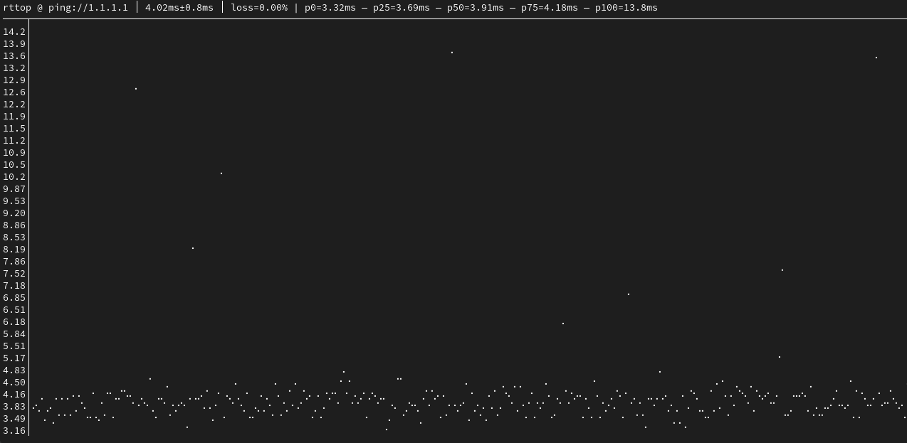

# rttop

A simple CLI tool to measure the **RTT** of your connection, like **top** for ping.



## Installing

Install a Go toolchain.

Then:
```shell
go install github.com/delthas/rttop/cmd/rttop@master
```

## Running

To test your ping against the default UDP rttop server:
```shell
rttop
```

To test your ping against any server supporting ping:
```shell
rttop google.com
```

For advanced usage, run `rttop -help`.

## License

MIT
